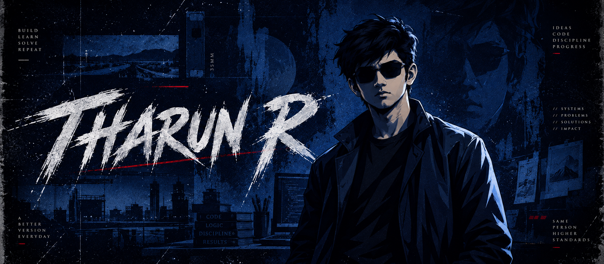

 

<h2 align="center">ABOUT</h2>

<h2 align="center">TECH STACK</h2>

**Daily Driver**

<!-- add more daily-driver badges here -->

**Also Comfortable With**

<!-- add more badges here -->

**Currently Learning**

<!-- add more badges here -->

<h2 align="center">PROJECTS</h2>

**[sequencekit](https://github.com/IHac-er/sequencekit)**: lightweight Python utility library for clean, consistent, reusable sequence operations

**[ender-chess-engine](https://github.com/IHac-er/ender-chess-engine)**: homebrew chess engine aspiring to be Stockfish one day (in progress)

<!-- add more projects: copy a block above and change the repo name -->

<h2 align="center">CONNECT</h2>

<!-- add more socials here -->

